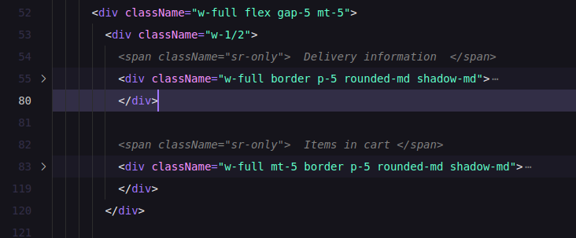

# SR-Only Highlighter

A Visual Studio Code extension that enhances accessibility development by highlighting elements with the `sr-only` class and providing a convenient code snippet for quick insertion.

## Features

- **Visual Highlighting**: Automatically detects and highlights elements with the `sr-only` class in HTML, JSX, and TSX files, making hidden elements easier to identify and manage.
- **Code Snippet**: Offers a snippet triggered by typing `cmt`, which inserts:

### How to Use

1. **Highlighting**: Open any HTML, React (JSX/TSX), or template file. The extension will automatically highlight elements using the `sr-only` class.
2. **Snippet Insertion**:
	- In your code editor, type `cmt`.
	- Select the suggested snippet to insert the screen-reader-only `` element.

### Installation

Install the extension from the [Visual Studio Code Marketplace](https://marketplace.visualstudio.com/items?itemName=YePyaeAung.sronly-highlighter).

### Release Notes
### 0.0.2
- Added `cmt` snippet for inserting screen-reader-only `` elements.
### 0.0.1
- Initial release: Highlight `sr-only` classes in the editor.

### Contributing

Contributions are welcome! If you have suggestions or improvements, feel free to submit a pull request.

Made with ❤️ by Ye Pyae Aung